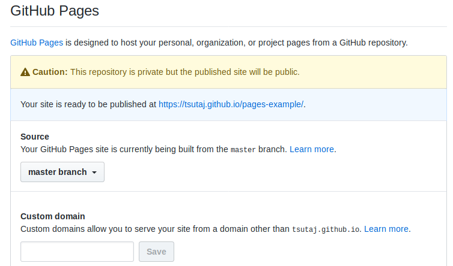

# Sample 1: CI 連携なし

自分で Jekyll の機能を拡張しない場合、CI との連携は特に必要ありません。GitHub Pages 側で勝手にビルドして HTML 化してくれるためです。

では、実際に Sample 1 までをビルドしてみましょう。([Getting Started](./getting_started.html) を読んでいない場合は先にそちらをお読みください)

## ビルド方法

Sample 2 は CI と連携しなければビルドできないため、Sample 2 の Markdown ファイルをビルド対象から除外します。`_config.yml` を開き、 `exclude: sample_002.md` のコメントアウトを外してください。

また、GitHub Pages の生成元ブランチを編集します。自分のリポジトリのページに行き、「Settings」タブをクリックします。すると「GitHub Pages」という項目がありますので、ここの「Source」を `master branch` に設定します。



`_config.yml` では自分のユーザー名やリポジトリ名などを指定する必要があるので、適宜自分の情報に差し替えてご利用ください。

あとは、本リポジトリの中身を全て `master` ブランチに push しましょう。

```sh
$ git add [files]
$ git commit -m "add contents until Sample 1"
$ git push -u origin HEAD
```

うまくいけば、`https://[username].github.io/pages-example/` にビルドされるはずです。Sample 2 はまだビルドしていないため、リンクを踏んでも 404 になります。

## おまけ: Markdown 記法テスト

以下は Markdown 記法テストです。主な記法を知りたい方は、[Markdown 記法 チートシート](https://gist.github.com/mignonstyle/083c9e1651d7734f84c99b8cf49d57fa) などを参考にしてください。

# 見出し 1
## 見出し 2
### 見出し 3
#### 見出し 4
##### 見出し 5
###### 見出し 6

|左揃えのサンプル|中央揃えのサンプル|右揃えのサンプル|
|:---|:---:|---:|
|テキスト|テキスト|テキスト|

* 箇条書き 1
    - 箇条書き 2
        + 箇条書き 3

1. ナンバリング 1
1. ナンバリング 2
1. ナンバリング 3

**太字** *斜体* ~~取り消し線~~

<span style="color:red;">HTML タグなどを直に書いても良いです</span>
