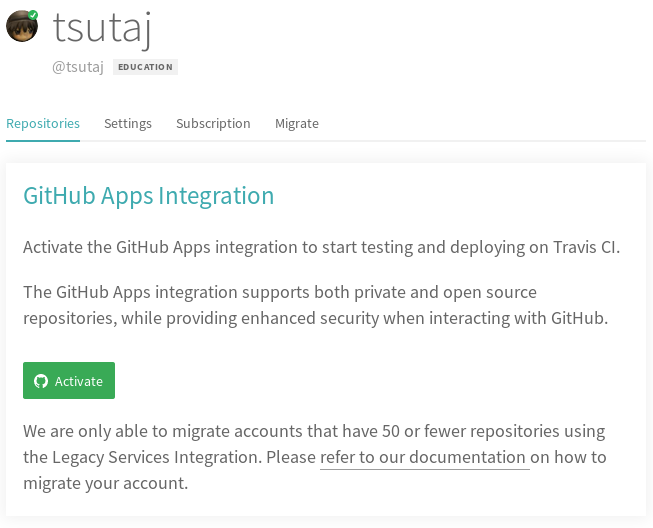

# Sample 2: CI 連携あり

突然ですが、以下の「ここをクリック」と書かれている箇所をクリックしてみてください。隠されていたコンテンツが表示されるようになるはずです。


- **これは隠されたコンテンツです**
- **「ここをクリック」を押すことで表示されたはずです**
- **「ここをクリック」をもう一度押すと、再び隠れます**


<p></p>

この機能は Jekyll に備わっている機能ではなく、自分で追加したプラグインによって実現されています (このプラグインは [Adding support for HTML5's details element to Jekyll](http://movb.de/jekyll-details-support.html) に記載されている内容を参考に作成されたものです)。このように、Jekyll は自分の手で機能を拡張することができます。

しかし、セキュリティの観点から GitHub Pages では自分で追加したプラグインをビルドできません。これでは困るので、CI (継続的インテグレーション) を活用して自作のプラグインも使えるようにしてみましょう。

以下で説明されている内容は [jekyll-travis](https://github.com/mfenner/jekyll-travis) の README を基に作成されており、本リポジトリ内の `.travis.yml` や `Rakefile` 等のファイルは `jekyll-travis` リポジトリから拝借したものです。詳細な説明がほしい方はこちらのリポジトリの README をご覧ください。また、プラグインの具体的な作成方法については [プラグイン \| Jekyll](http://jekyllrb-ja.github.io/docs/plugins/) に委ねますので参考にしてください。

## Travis CI の準備

まず、[Travis CI](https://travis-ci.com) へアクセスして、自分が利用している GitHub アカウントの情報をもとに登録を済ませてください。

登録したての状態で Travis CI の Dashboard に行くと、「GitHub Apps Integration」と出ているはずです。緑の「Activate」というボタンをクリックします。



すると、どのリポジトリに Travis CI をインストールするか聞かれます。CI を適用したいリポジトリが含まれるように選択し、「Approve & Install」をクリックします。


これで Travis CI のインストールは完了です。Dashboard にリポジトリが表示されるようになったと思いますので、リポジトリを選択してリンク先に飛び、「More Oprions → Settings」をクリックします。すると、Environment Variables (環境変数) を設定する項目がありますので、以下を入力します。**DISPLAY VALUE IN BUILD LOG にチェックを入れないように注意してください。**

* `GIT_NAME` (GitHub アカウント名)
* `GIT_EMAIL` (アカウント名に紐付けられているメールアドレス)
* `GH_TOKEN` (Personal Access Token)
  - Token を自分で発行する必要があります。詳しくは [コマンドライン用の個人アクセストークンを作成する - GitHub ヘルプ](https://help.github.com/ja/github/authenticating-to-github/creating-a-personal-access-token-for-the-command-line) を参照してください。
  - commit や push が目的なので、Token に付与する権限は `repo` のみでよいです。


これで、Travis CI を利用する準備ができました。

## ビルドしてみよう

Sample 1 まででは GitHub Pages が勝手にビルドしてくれていましたので `master` ブランチにあるものをそのままビルドさせていましたが、今回は GitHub Pages のビルド機能は使わずに CI を利用して自分でビルドさせます。生成元と生成先のブランチは異なるほうが嬉しいため、今回は **`master` ブランチに Markdown ファイルを置き、その内容を `gh-pages` ブランチにビルド** させることにしましょう。

Sample 1 では生成元ブランチを `master` にしていましたが、これを `gh-pages` ブランチに変更します。`gh-pages` ブランチを生成したら、[Sample 1](./sample_001.html) における生成元ブランチの設定と同様に、`gh-pages` ブランチを代わりに生成元ブランチとして指定します。

また、Sample 1 のときと同様に`_config.yml` は適宜自分の情報に差し替えてください。特に、CI を用いたビルドにおいて `Rakefile` 上で以下の変数を使用しますので、必ず設定を変更してください。

```yml
username: tsutaj # 自分の GitHub ユーザー名
repo: pages-example # リポジトリ名
destination: _site/ # 基本的にいじる必要はないです
```

Sample 1 で `sample_002.md` を exclude していた方は、再びその行をコメントアウトすることを忘れないでください。ここまで操作しましたら、`master` ブランチに push します。`gh-pages` ブランチへの push は `Rakefile` 等が Travis CI 上で自動でやってくれます。

```sh
$ git add [files]
$ git commit -m "add pages files"
$ git push origin HEAD
```

うまくいけば、`master` ブランチに push したものが `gh-pages` ブランチにビルドされるはずです。

